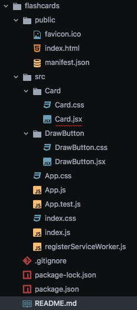
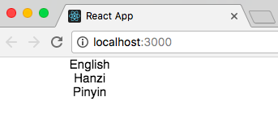
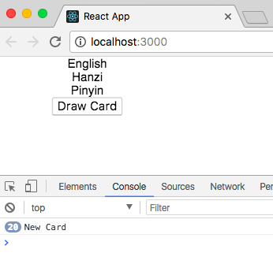

The aim of this app is to make a study aid of flashcards for all the python built-in functions, methods etc that are useful in solving algorithms. The flashcards will read from a Firebase `.json` file.

In our App.js we are going to return a flashcard and pass data from firebase database to the constant display object of Card.

Each side of the card, question then answer will be represented by two sub divs of same card container.

Make a GitHub repo and clone into a local repository.
Make sure node and react are installed.
```
create react-app flashcards
```
Make a Development Branch
```
git branch development
git checkout development
```
In src made two folders with two `.jsx` files


`Card.jsx` file is as follows
```js
import React, { Component } from 'react';
import './Card.css';

// The data that we are going to pass our card is going to be 'props'
// The card container will hold a card with a front and back
// Properites get pulled from App.js
const Card = (props) => (
  <div className='card-container'>
    <div className='card'>
      <div className='front'>
        <div className='eng'>{props.eng}</div>
      </div>
      <div className='back'>
        <div className='han'>{props.han}</div>
        <div className='pin'>{props.pin}</div>
      </div>
    </div>
  </div>
);

export default Card;
```

`App.js` file is as follows
```js
import React, { Component } from 'react';
import './App.css';
import Card from './Card/Card';

//  App is our concrete class extending the abstract component class. super allows props to our parent component
class App extends Component {
  constructor (props) {
    super(props);

    // mock data
    this.state = {
      cards: [
        {id: 1, eng: 'English', han: 'Hanzi', pin: 'Pinyin'},
        {id: 2, eng: 'English_2', han: 'Hanzi_2', pin: 'Pinyin_2'}
      ],
      currentCard: {}
    };
  }

// Called immediately after constructor and before Component rendered
// As Component gets ready to mount define constant for the current cards and set it to this.state.cards defined above.
// Then we wish to take a a specific card from the current cards using the math function.
  componentWillMount () {
    const currentCards = this.state.cards;

    this.setState({
      cards: currentCards,
      currentCard: this.getRandomCard(currentCards)
    });
  }

  // Define the random card picker
  // 0-1 *cards.length. If card length is 2 get an answer from 0 to 1.9999999. Rounded down gives either 0 or 1 for index.
  getRandomCard (currentCards) {
    var card = currentCards[Math.floor(Math.random() * currentCards.length)];
    return (card);
  }

  // Insert a non-random card picker as well

  // Pass some props into card component
  // 'eng' will exist when the component is about to mount and we set its state to a random card from our array which contains an eng property on it with value of either English or English_2
  // Properties get pulled of and sent to Card Component
  render () {
    return (
      <div className='App'>
        <Card eng={this.state.currentCard.eng}
          han={this.state.currentCard.han}
          pin={this.state.currentCard.pin} />
      </div>
    );
  }
}

export default App;
```
Open browser at localhost:3000 and we see...


Let's add, commit, push, and tag all our changes to GitHub
```
git add -A
git commit -m"basic card func working"
git push --set-upstream origin development
git tag -a v0.1 -m"This is first version"
git tag
git push --tags
```
### v0.2 tidied up README file

### v0.3 Make a button that updates (randomizes) the current card

Add `DrawButton.jsx`

```js
import React, { Component } from 'react';
import './DrawButton.css';

// create a drawCard() method applied to this
// need to bind this to drawButton component or it would be undefined
// Achieved by "this.drawCard = this.drawCard.bind(this)"
class DrawButton extends Component {
  constructor (props) {
    super(props);

    this.drawCard = this.drawCard.bind(this);
  }

  // update the state of app.js to get a new random card when the state is updated. Pass drawCard on props and pass to drawCard component
  // The onClick event will fire that drawCard method in our App component
  // see app for drawCard definition
  drawCard () {
    this.props.drawCard();
  }

  render (props) {
    return (
      <div className='buttonContainer'>
        <button className='btn' onClick={this.drawCard}>Draw Card</button>
      </div>
    );
  }
}

export default DrawButton;
```
Modify `App.js`

```js
import React, { Component } from 'react';
import './App.css';
import Card from './Card/Card';
// Import DrawButton
import DrawButton from './DrawButton/DrawButton';

class App extends Component {
  constructor (props) {
    super(props);

    this.updateCard = this.updateCard.bind(this);

    this.state = {
      cards: [
        {id: 1, eng: 'English', han: 'Hanzi', pin: 'Pinyin'},
        {id: 2, eng: 'English_2', han: 'Hanzi_2', pin: 'Pinyin_2'}
      ],
      currentCard: {}
    };
  }

  componentWillMount () {
    const currentCards = this.state.cards;

    this.setState({
      cards: currentCards,
      currentCard: this.getRandomCard(currentCards)
    });
  }

  getRandomCard (currentCards) {
    var card = currentCards[Math.floor(Math.random() * currentCards.length)];
    return (card);
  }

  // define the updateCard method for a test
  updateCard () {
    console.log('New Card');
  }

  // Add DrawButton Component and call updateCard method
  render () {
    return (
      <div className='App'>
        <div className='cardRow'>
          <Card eng={this.state.currentCard.eng}
            han={this.state.currentCard.han}
            pin={this.state.currentCard.pin} />
        </div>
        <div className='buttonRow'>
          <DrawButton drawCard={this.updateCard} />
        </div>
      </div>
    );
  }
}

export default App;
```

Clicking button in `localhost:3000` does update New Card number...


We now change out `updateCard()` function from
```js
updateCard () {
  console.log('New Card');
}
```
to the following. This turns the `console.log` function into a `getRandomCard` function with a button push.
```js
updateCard () {
  const currentCards = this.state.cards;
  this.setState({
    currentCard: this.getRandomCard(currentCards)
  });
}
```
Lets push these updates onto Github
```
git add -A
git commit -m"DrawButton function made"
git push
git tag -a v0.3 -m"Draw Button Function"
git push --tags
```

Go to Firebase [console](https://console.firebase.google.com/?pli=1)
Add all info to Config/Firebase/db_config.
How will i hide all this?

Back in terminal `npm install --save firebase` will install firebase and save a ref to it in our package.json file

Added firebase-database to app.js

Added db_config to .gitignore... did i do it correctly?

created a new folder data with cards.json

Back in Firebase, click on database, click on veritcal dots, import json, browse to our directory with cards.json, import

In Firebase and set `Rules` read and write rules to true.

#THIS SHOULD NOT BE DONE IN PRODUCTION!

Back in app.js
Our cards [] is empty.
Thus, we need to modify the componentWillMount to link to our firebase database so we use Firebases `on(child_added)` functionality to return all of our current cards.

In `App.js` add the following....
```js
import React, { Component } from 'react';
import './App.css';
import Card from './Card/Card';
import DrawButton from './DrawButton/DrawButton';

import { DB_CONFIG } from './Config/Firebase/db_config.js';

import firebase from 'firebase/app';
import 'firebase/database';

//  App is our concrete class extending the abstract component class. super allows props to our parent component
// bind this update card
// need to call firebase initialize app and pass it our config
class App extends Component {
  constructor (props) {
    super(props);

    this.app = firebase.initializeApp(DB_CONFIG);

    this.database = this.app.database().ref().child('cards');

    this.updateCard = this.updateCard.bind(this);

    this.state = {
      cards: [],
      currentCard: {}
    };
  }

// snap takes snapshot of database
// instead of Firebases key prop we could use snap.val().id as our data does contain id

  componentWillMount () {
    const currentCards = this.state.cards;

    this.database.on('child_added', snap => {
      currentCards.push({
        id: snap.key,
        eng: snap.val().eng,
        han: snap.val().han,
        pin: snap.val().pin
      });
      this.setState({
        cards: currentCards,
        currentCard: this.getRandomCard(currentCards)
      });
    });
  }

  // Define the random card picker
  // 0-1 *cards.length. If card length is 2 get an answer from 0 to 1.9999999. Rounded down gives either 0 or 1 for index.
  getRandomCard (currentCards) {
    var card = currentCards[Math.floor(Math.random() * currentCards.length)];
    return (card);
  }

  // test the updateCard method
  updateCard () {
    const currentCards = this.state.cards;
    this.setState({
      currentCard: this.getRandomCard(currentCards)
    });
  }

  // Insert a non-random card picker as well

  // Pass some props into card component
  // 'eng' will exist when the component is about to mount and we set its state to a random card from our array which contains an eng property on it with value of either English or English_2
  render () {
    return (
      <div className='App'>
        <div className='cardRow'>
          <Card eng={this.state.currentCard.eng}
            han={this.state.currentCard.han}
            pin={this.state.currentCard.pin} />
        </div>
        <div className='buttonRow'>
          <DrawButton drawCard={this.updateCard} />
        </div>
      </div>
    );
  }
}

export default App;
```

So what's happening in the app.js is...
So we need to update the state of our Component when we get the callback from firebase saying that a child has been added.
So `on.('child_added')` will be called once for each existing child in our dataset and again when any new data is added.

Lets push to GitHub and work on the styling
```
git add -A
git commit -m"Firebase database added and connected. All working"
git push
git tag -a v0.4 -m"Firebase database added and connected. All working"
git push --tags
```

### v0.5 Styling
I need to change the following as they are awful
`Cards.css`
`DrawButton.css`
`App.css`

### v0.6 refactor to python built-in functions
Web Scraping
`pip3 install bs4`

python3 terminal
```python
from bs4 import BeautifulSoup
soup = BeautifulSoup(glossary.content, 'html.parser')

print(soup.prettify())

list(soup.children)

soup.find_all('dt')

for dt_tag in soup.find_all('dt'):
  print(dt_tag.text, dt_tag.next_sibling)

for dt_tag in soup.find_all('dt'):
  print(dt_tag.text, dt_tag.next_sibling)

```
